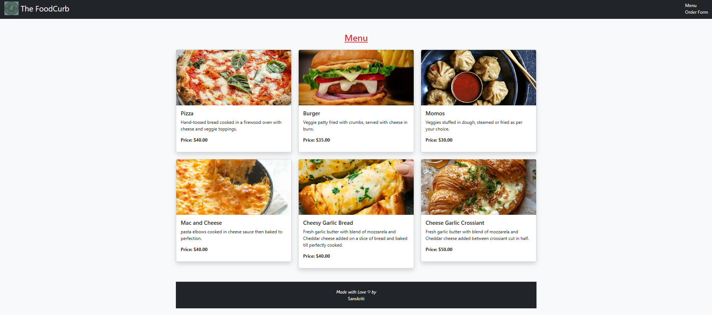
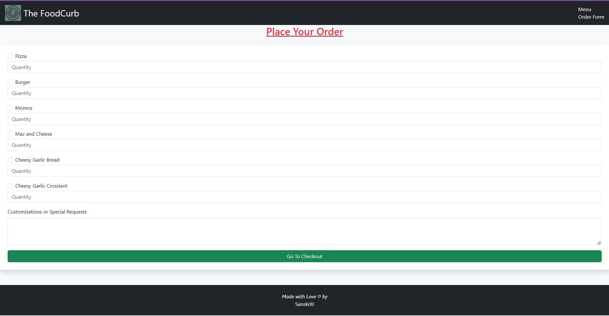
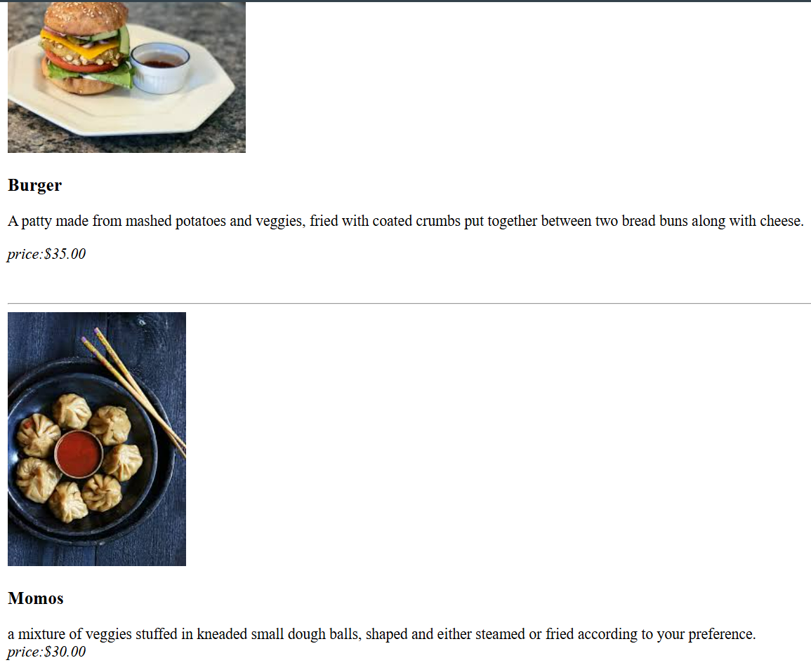
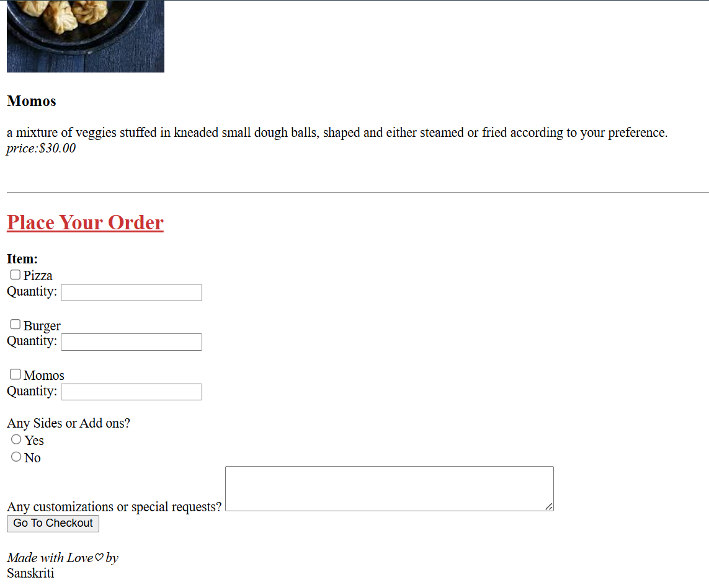

# 🍽️ Restaurant Menu Website

Welcome to my **Restaurant Menu Website** — a simple yet elegant web project built using **pure HTML (and a touch of creativity)**.  
It showcases a **2-page restaurant menu** and a **single-page compact menu**, perfect for both desktop and mobile use.  

---

## ✨ Features

- 🧾 **Two menu versions** — choose between a multi-page or single-page layout  
- 🎨 **Minimal & aesthetic design** with a restaurant-inspired theme  
- 📱 **Mobile-friendly structure** (easily extendable with CSS/JS)  
- ⚡ **Fast loading** — made entirely with HTML  
- 🖼️ **Easily customizable** — update dishes, prices, or design in seconds  

---

## 🖥️ Project Preview

### 🍕 1️⃣ Two-Page Menu
A traditional restaurant-style menu with separate sections for **Starters**, **Main Course**, and **Desserts**.  
Perfect for a multi-course dining experience.  

📸 **Screenshot:**  


---


---

### 🍔 2️⃣ One-Page Menu  
A modern compact menu that displays all items on a single scrollable page — ideal for cafés and takeaways.  

📸 **Screenshot:**  


---


---


---

## 🚀 Steps to Run the Project

### Step 1️⃣: Clone the Repository
```bash
git clone https://github.com/yourusername/restaurant-menu.git
```

### Step 2️⃣: Navigate to the Project Folder
```bash
cd restaurant-menu
```
### Step 3️⃣: Open the Menu Pages

To view the Single Page Menu, open  
👉 "one page menu.html" in your browser

To view the Two Page Menu, open   
👉 "2 page menu" in your browser

## 👩‍🍳 Author
**Sanskriti**  
Building simple and aesthetic web experiences 🍴


